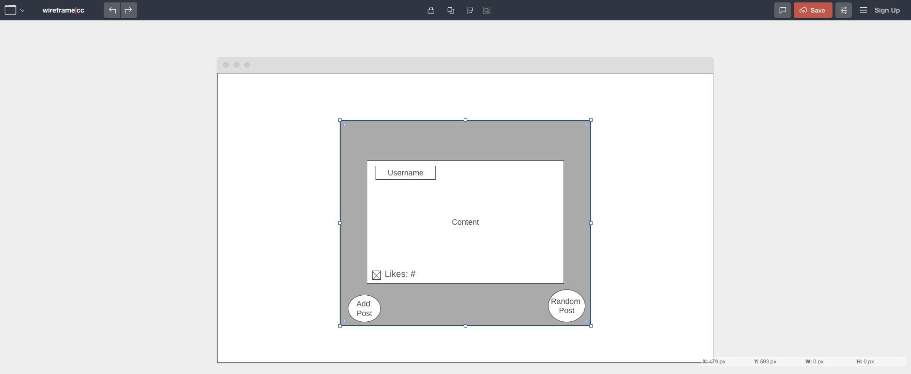
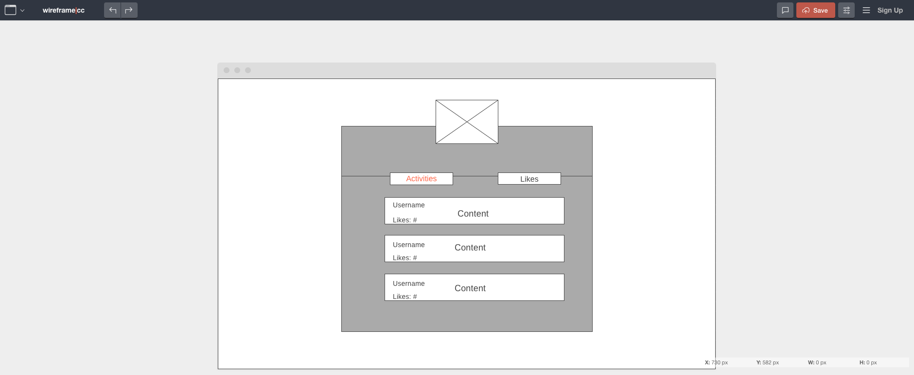

# Active - Angular Single Page Application

This application is a front end focus social media SPA. The components may resemble other platforms for its asthetics. As this project scale, the functionality will showcase how unique it can be. This program is one of two parts for the full stack application. It requires my back end API application linked [here](https://github.com/t-hendricks/active-spring-boot-api) in order to make http requests and load data.

## Initial Approach

My motto when learning any new subject or developing new ideas is 'function over fashion'. I want the components to be tangible and active. So I kept my initial design plain as possible to reduce scope creep. 

### Wireframe: Register / Login

### Wireframe: Random Activity

### Wireframe: Profile

## Technologies Used
- ### Version control:
    - 
    - 
- ### Developer Tools:
    - 
    - 
- ### Programming:
    - 
    - 
    - 
    - 
    - 

## What I Would Do Differently
- Build out a timeline to meet deadlines

## Future Plans
- Implement route-guards
- Implement custom observables
- Add custom styling

## Resources
These are general websites that helped me accomplish most of my roadblocks.
- [Stack Overflow](https://stackoverflow.com/)
- [Angular Docs](https://angular.io/docs)
- General Assembly's Lessons

## Credits
Developers that I'm grateful for helping my initial accomplishments.
- [Suresh](https://github.com/sureshmelvinsigera/)
- [Leo](https://github.com/LRodriguez92)
- Dhrubo

## Development server

Run `ng serve` for a dev server. Navigate to `http://localhost:4200/`. The application will automatically reload if you change any of the source files.